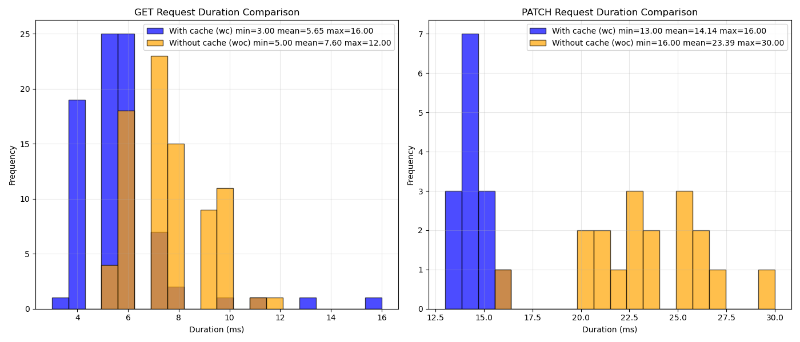

# Project Name

some description

### Импрувчик

Засчет частичного переноса часто меняющихся во время игры сущностей в Redis было уменьшено время на GET и POST запросы. Также засчет фонового воркера из Celery основная база данных (Postgres) с каким-то интервалом синхронизируется с кэшем Redis.

После кэширования максимальное время на PATCH запрос сократилось с 30 до 16 млсек. А среднее с 23,39 до 14,14 млсек.

</img>

## Usage

text

## Demos

gifs